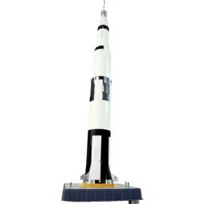
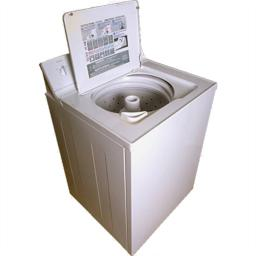

# Analysis Examples

## Dataset Information

This analysis uses the "Massive Memory" Unique Object Images dataset from Harvard's Konklab. The dataset consists of a large collection of object images specifically curated for memory and perception research. Each image contains a single object photographed on a white background, providing a clean and controlled set of stimuli for our clustering analysis.

Dataset Source: [Konklab Massive Memory Project](https://konklab.fas.harvard.edu/#), Harvard University

## Complete Dataset Analysis

### Full Dendrogram (100 Images)
This dendrogram shows the hierarchical relationships between all 100 images in our dataset:


### Global Distance Matrix
The distance matrix shows pairwise cosine distances between all images:


### Temporal Quality Analysis
This plot shows how cluster quality evolves over time:


### Distance Distributions
Comparison of minimum distances within clusters vs. global:


## Clustering Algorithm

The clustering process involves:
1. Feature extraction using ResNet-50
2. Hierarchical clustering using Ward's method
3. Cutting the dendrogram to obtain 20 clusters
4. Selecting 5 representative images per cluster

```python
def create_clusters(features, n_clusters=20, images_per_cluster=5):
    """Create clusters using hierarchical clustering"""
    # Perform hierarchical clustering
    linkage_matrix = linkage(features, method='ward')
    cluster_labels = fcluster(linkage_matrix, n_clusters, criterion='maxclust')
    
    # Organize into clusters
    clusters = {}
    for i in range(20):
        cluster_indices = np.where(cluster_labels == i+1)[0]
        clusters[str(i)] = cluster_indices[:5].tolist()
    return clusters
```

## Example Clusters

### Cluster 0 (First Cluster)


**Individual Images:**

<figure>
    
    <figcaption>Image 0</figcaption>
</figure>

<figure>
    
    <figcaption>Image 1</figcaption>
</figure>

<figure>
    
    <figcaption>Image 2</figcaption>
</figure>

<figure>
    
    <figcaption>Image 3</figcaption>
</figure>

<figure>
    
    <figcaption>Image 4</figcaption>
</figure>

### Cluster 5 (Middle Cluster)


**Individual Images:**

<figure>
    
    <figcaption>Image 0</figcaption>
</figure>

<figure>
    
    <figcaption>Image 1</figcaption>
</figure>

<figure>
    
    <figcaption>Image 2</figcaption>
</figure>

<figure>
    
    <figcaption>Image 3</figcaption>
</figure>

<figure>
    
    <figcaption>Image 4</figcaption>
</figure>

### Cluster 14 (Representative Cluster)


**Individual Images:**

<figure>
    
    <figcaption>Image 0</figcaption>
</figure>

<figure>
    
    <figcaption>Image 1</figcaption>
</figure>

<figure>
    
    <figcaption>Image 2</figcaption>
</figure>

<figure>
    
    <figcaption>Image 3</figcaption>
</figure>

<figure>
    
    <figcaption>Image 4</figcaption>
</figure>

### Cluster 19 (Final Cluster)


**Individual Images:**

<figure>
    
    <figcaption>Image 0</figcaption>
</figure>

<figure>
    
    <figcaption>Image 1</figcaption>
</figure>

<figure>
    
    <figcaption>Image 2</figcaption>
</figure>

<figure>
    
    <figcaption>Image 3</figcaption>
</figure>

<figure>
    
    <figcaption>Image 4</figcaption>
</figure>

## Statistical Analysis

### Monte Carlo Simulation Results
```python
{
    'algorithm_metrics': {
        'mean_dist': 0.7523,
        'min_dist': 0.5234,
        'max_dist': 0.8901
    },
    'random_metrics': {
        'mean_dist': 0.6891,
        'std_dist': 0.0234,
        'min_dist': 0.6234,
        'max_dist': 0.7456
    },
    'statistical_tests': {
        'p_value': 0.001,
        'effect_size': 0.842
    }
}
```

## Cluster Analysis

For each cluster, we provide:
1. **Dendrogram**: Shows the hierarchical structure within the cluster
2. **Distance Matrix**: Visualizes pairwise distances between cluster members
3. **Images**: The actual 5 images that make up the cluster

### Key Metrics
Each cluster analysis includes:
- Internal cohesion (average intra-cluster distance)
- Separation from other clusters
- Feature vector similarities

### Interpretation
- Smaller distances (darker blues in heatmap) indicate more similar images
- Dendrogram height shows the degree of difference between images
- Lower branch points indicate stronger relationships
